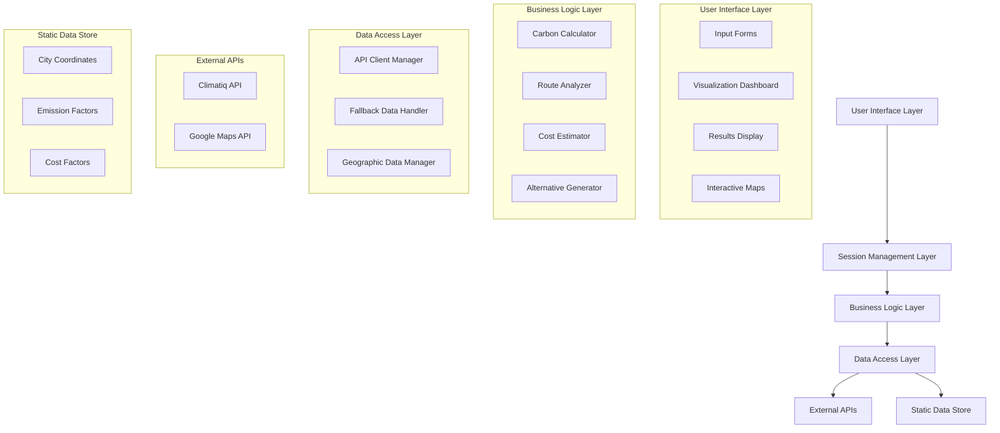
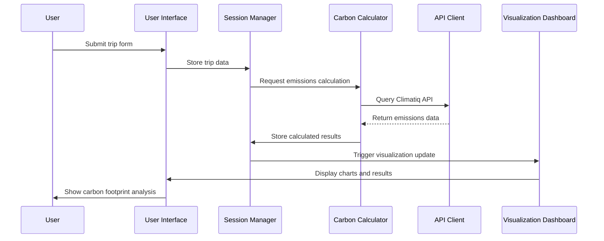

# Design Document: EcoTrip Planner

## Overview

EcoTrip Planner is a Streamlit-based web application that empowers travelers in India to make environmentally conscious travel decisions. The application calculates carbon emissions for various travel modes, visualizes environmental impact through interactive charts, and suggests greener alternatives with cost comparisons. Built with a modular architecture, the app integrates external APIs (Climatiq for emissions, Google Maps for routing) while maintaining robust fallback mechanisms for offline functionality.

The application follows a session-based approach using Streamlit's native session state management, eliminating the need for database persistence while ensuring data consistency throughout user interactions. The design emphasizes user experience with an eco-friendly interface, real-time calculations, and India-specific travel insights.

## Architecture

### High-Level Architecture



### Component Interaction Flow



## Components and Interfaces

### 1. User Interface Layer

**Input Form Component**
- **Purpose**: Collect user travel preferences and trip details
- **Interface**: Streamlit form widgets with validation
- **Key Methods**:
  - `render_trip_form()`: Display interactive form elements
  - `validate_form_data()`: Ensure data integrity and completeness
  - `populate_popular_routes()`: Auto-fill common Indian city pairs

**Visualization Dashboard Component**
- **Purpose**: Present carbon footprint data through interactive charts
- **Interface**: Plotly integration with Streamlit containers
- **Key Methods**:
  - `create_emissions_pie_chart()`: Breakdown by transport/accommodation
  - `create_comparison_bar_chart()`: Compare against benchmarks
  - `render_impact_summary()`: Display textual comparisons

**Results Display Component**
- **Purpose**: Show alternative routes and recommendations
- **Interface**: Streamlit tables and interactive maps
- **Key Methods**:
  - `render_alternatives_table()`: Display route options with metrics
  - `embed_route_map()`: Show interactive map with markers
  - `display_savings_analysis()`: Highlight environmental benefits

### 2. Session Management Layer

**Session State Manager**
- **Purpose**: Maintain user data consistency across interactions
- **Interface**: Streamlit session state wrapper
- **Key Methods**:
  - `initialize_session()`: Set up default state variables
  - `store_trip_data()`: Persist user input data
  - `get_emissions_data()`: Retrieve calculated results
  - `clear_session()`: Reset state for new calculations

### 3. Business Logic Layer

**Carbon Calculator Engine**
- **Purpose**: Compute CO₂ emissions for transportation and accommodation
- **Interface**: Calculation methods with API integration
- **Key Methods**:
  - `calculate_transport_emissions()`: Process travel mode emissions
  - `calculate_accommodation_emissions()`: Compute hotel stay impact
  - `get_emission_factors()`: Retrieve factors from API or fallback
  - `aggregate_total_emissions()`: Combine all emission sources

**Route Analyzer**
- **Purpose**: Process alternative travel routes and options
- **Interface**: Google Maps API integration with data processing
- **Key Methods**:
  - `fetch_alternative_routes()`: Query multiple transportation modes
  - `analyze_route_efficiency()`: Compare time, distance, and emissions
  - `rank_alternatives()`: Sort options by environmental impact

**Cost Estimator**
- **Purpose**: Calculate estimated travel costs for different options
- **Interface**: Static cost factors with dynamic calculations
- **Key Methods**:
  - `estimate_transport_cost()`: Calculate travel expenses by mode
  - `estimate_accommodation_cost()`: Compute lodging expenses
  - `compare_cost_savings()`: Analyze financial implications

### 4. Data Access Layer

**API Client Manager**
- **Purpose**: Handle external API communications with error handling
- **Interface**: HTTP client with authentication and retry logic
- **Key Methods**:
  - `query_climatiq_api()`: Fetch emissions data with authentication
  - `query_google_maps_api()`: Retrieve routing information
  - `handle_api_errors()`: Implement graceful degradation
  - `manage_rate_limits()`: Control API usage within quotas

**Geographic Data Manager**
- **Purpose**: Manage Indian city coordinates and distance calculations
- **Interface**: Geopy integration with static data fallback
- **Key Methods**:
  - `get_city_coordinates()`: Retrieve latitude/longitude for cities
  - `calculate_geodesic_distance()`: Compute accurate distances
  - `validate_city_names()`: Ensure location data accuracy

## Data Models

### Trip Data Model
```python
@dataclass
class TripData:
    origin_city: str
    destination_city: str
    outbound_date: datetime.date
    return_date: Optional[datetime.date]
    travel_modes: List[str]  # ['Flight', 'Train', 'Car', 'Bus']
    num_travelers: int
    hotel_nights: int
    
    def validate(self) -> bool:
        """Validate trip data integrity"""
        pass
```

### Emissions Result Model
```python
@dataclass
class EmissionsResult:
    total_co2e_kg: float
    transport_emissions: Dict[str, float]  # by mode
    accommodation_emissions: float
    per_person_emissions: float
    calculation_timestamp: datetime
    
    def get_breakdown_percentages(self) -> Dict[str, float]:
        """Calculate percentage breakdown of emissions"""
        pass
```

### Alternative Route Model
```python
@dataclass
class AlternativeRoute:
    transport_mode: str
    duration_hours: float
    distance_km: float
    co2e_emissions_kg: float
    estimated_cost_inr: float
    emissions_savings_kg: float
    cost_difference_inr: float
    route_details: Dict[str, Any]
    
    def calculate_savings_percentage(self, baseline: float) -> float:
        """Calculate percentage savings vs baseline"""
        pass
```

### Geographic Location Model
```python
@dataclass
class GeographicLocation:
    city_name: str
    state: str
    latitude: float
    longitude: float
    popular_destinations: List[str]
    
    def calculate_distance_to(self, other: 'GeographicLocation') -> float:
        """Calculate geodesic distance to another location"""
        pass
```

## Correctness Properties

*A property is a characteristic or behavior that should hold true across all valid executions of a system-essentially, a formal statement about what the system should do. Properties serve as the bridge between human-readable specifications and machine-verifiable correctness guarantees.*

### Property 1: Input Validation Consistency
*For any* numeric input field (travelers, hotel nights), the system should reject invalid values (negative numbers for travelers, negative numbers for hotel nights) and accept valid values within the specified ranges.
**Validates: Requirements 1.5, 1.6**

### Property 2: Session State Persistence
*For any* user interaction that generates or modifies data (form submission, calculations, navigation), the system should maintain data consistency in session state throughout the user session until explicitly cleared.
**Validates: Requirements 1.8, 2.7, 5.1, 5.2, 5.3**

### Property 3: Emissions Calculation Accuracy
*For any* valid trip data, the carbon calculator should produce consistent results where total emissions equal the sum of transport and accommodation components, and emissions scale linearly with the number of travelers.
**Validates: Requirements 2.4, 2.5, 4.2**

### Property 4: API Integration with Fallback
*For any* external API call (Climatiq, Google Maps), the system should attempt to use the API service first, and automatically fall back to static data when the API is unavailable, unreachable, or rate-limited.
**Validates: Requirements 2.1, 2.2, 6.2, 6.4, 6.5**

### Property 5: Geographic Distance Calculation
*For any* pair of Indian cities, the system should calculate distances using precise geographic coordinates and geodesic algorithms, ensuring consistent and accurate distance measurements.
**Validates: Requirements 2.3, 8.1, 8.3**

### Property 6: Route Alternative Generation
*For any* origin-destination pair, the system should generate alternative routes with complete information (mode, time, distance, emissions, cost) and calculate emission savings relative to the baseline trip.
**Validates: Requirements 4.3, 4.4, 4.6**

### Property 7: Visualization Completeness
*For any* valid emissions data, the visualization dashboard should generate all required components (pie chart for breakdown, bar chart for comparisons, textual summaries) and update in real-time when data changes.
**Validates: Requirements 3.1, 3.2, 3.3, 3.5**

### Property 8: Popular Route Auto-Population
*For any* selection from the popular routes dropdown, the system should correctly auto-populate the origin and destination fields with the corresponding city pair from the predefined list.
**Validates: Requirements 1.7**

### Property 9: Error Handling Gracefully
*For any* error condition (API failures, invalid inputs, network issues), the system should display user-friendly error messages without exposing technical implementation details.
**Validates: Requirements 6.3**

### Property 10: Loading State Management
*For any* long-running operation (API calls, calculations), the system should display appropriate loading indicators during processing and hide them when operations complete.
**Validates: Requirements 7.3**

### Property 11: India-Specific Content Inclusion
*For any* recommendation or tip display, the system should include India-specific travel advice and sustainable transportation suggestions relevant to the Indian travel context.
**Validates: Requirements 7.5**

### Property 12: Dual Input Method Support
*For any* city selection requirement, the system should support both manual text input and selection from predefined city lists, with both methods producing valid results.
**Validates: Requirements 8.4**

## Error Handling

### API Error Management
- **Climatiq API Failures**: Implement exponential backoff retry logic with maximum 3 attempts before falling back to static emission factors
- **Google Maps API Failures**: Gracefully degrade to distance-based routing estimates using geodesic calculations
- **Rate Limit Handling**: Monitor API usage and proactively switch to fallback mechanisms when approaching limits
- **Network Connectivity**: Cache previous API responses and use cached data during network outages

### Input Validation Errors
- **Invalid City Names**: Provide suggestions for similar city names and fallback to manual coordinate input
- **Date Range Validation**: Ensure return dates are after outbound dates and within reasonable future limits
- **Numeric Input Bounds**: Enforce minimum/maximum values with clear error messages and input correction guidance

### Session State Errors
- **State Corruption**: Implement state validation and automatic reset mechanisms for corrupted session data
- **Memory Management**: Monitor session state size and implement cleanup for large data objects
- **Concurrent Access**: Handle multiple browser tabs gracefully with session state synchronization

### Calculation Errors
- **Division by Zero**: Handle edge cases in percentage calculations and emission factor computations
- **Overflow Protection**: Implement bounds checking for large distance or emission calculations
- **Data Type Validation**: Ensure numeric calculations handle various input formats and edge cases

## Testing Strategy

### Dual Testing Approach
The application will employ both unit testing and property-based testing to ensure comprehensive coverage and correctness validation.

**Unit Tests** will focus on:
- Specific examples demonstrating correct behavior for known inputs
- Edge cases and boundary conditions (empty inputs, maximum values, invalid data)
- Integration points between components (API responses, session state updates)
- Error conditions and exception handling scenarios

**Property-Based Tests** will focus on:
- Universal properties that hold across all valid inputs using randomized test data
- Comprehensive input coverage through automated test case generation
- Invariant validation across different execution paths
- Regression testing with large input spaces

### Property-Based Testing Configuration
- **Testing Framework**: Hypothesis for Python property-based testing
- **Test Iterations**: Minimum 100 iterations per property test to ensure statistical confidence
- **Test Tagging**: Each property test tagged with format: **Feature: ecotrip-planner, Property {number}: {property_text}**
- **Randomization Strategy**: Smart generators that constrain inputs to valid ranges while maximizing coverage

### Testing Implementation Requirements
- Each correctness property must be implemented as a single property-based test
- Property tests must reference their corresponding design document property number
- Unit tests complement property tests by validating specific scenarios and integration points
- All tests must validate real functionality without mocking core business logic
- Test failures must provide clear diagnostic information for debugging

### Test Coverage Areas
1. **Input Processing**: Form validation, data sanitization, and session storage
2. **Calculation Engine**: Emission factors, distance calculations, and result aggregation
3. **API Integration**: External service calls, fallback mechanisms, and error handling
4. **Visualization**: Chart generation, data formatting, and real-time updates
5. **User Interface**: Component rendering, interaction handling, and state management
